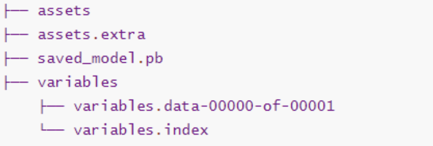
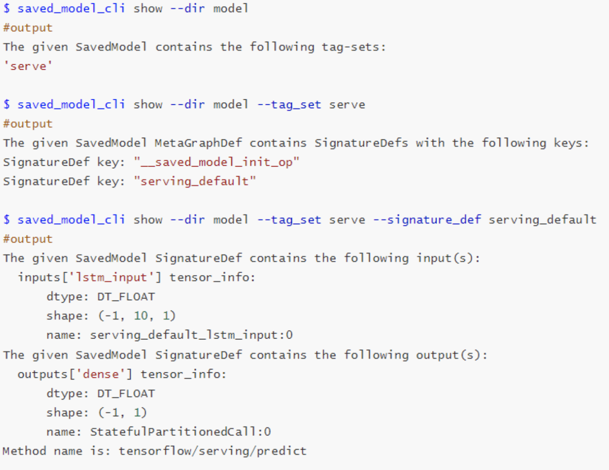

# SupervisedAlgorithmsforPredictiveMaintenance

### Training LSTM model using Tensorflow

Using an LSTM model to predict the capacity of a battery. The training and testing data for the battery were obtained from the NASA dataset. 

#### Overview

1. Load data
2. pre-process data
   1. Transform data into stationary
   2. normalization
   3. train-test split
   4. Data preparation for model
3. Build and train the model 
4. Prediction

### Save model to saved model

model folder contains the following files:



- assets and assets.extra: contains files used by the TensorFlow graph and there may be an assets.extra
  directory for any files not used by the TensorFlow graph. 
- saved model.pb: stores the actual Tensorflow program, or model, and a set of named signatures, each identifying a function that accepts tensor inputs and produces tensor outputs. 
- variables: contains a standard training checkpoint, which captures the exact value of all parameters used by a model.

### Saved Model Inspection and Execution 

use saved_model_cli, a command tool to specify the information including input and output tensor for tensorflow C API.



The first command shows all available tag-sets in the SavedModel. Then, all the SignatureDef keys for
this tag-set can be found. Finally, passing in the SignatureDef Key to command can show all inputs and
outputs Tensor info, including tensor key value, dtype and shape of the input tensors.


### Deploy Tensorflow C API

code see [main.c](Battery_Capacity_Forecasting/main.c)

#### compile the code

```
gcc -I<path_of_tensorflow_api>/include/ -L<path_of_tensorflow_api>/lib main.c -ltensorflow -o main.out
```

make sure C library is exported in the environment

```
export LD_LIBRARY_PATH=$LD_LIBRARY_PATH:<path_of_tensorflow_api>/lib 

```

#### run the code

```
./main.out
```

